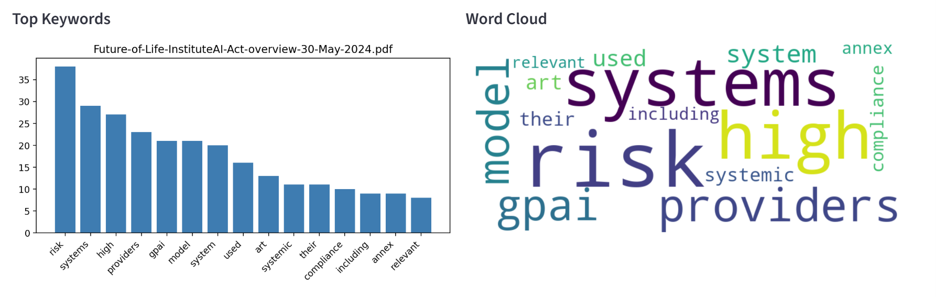
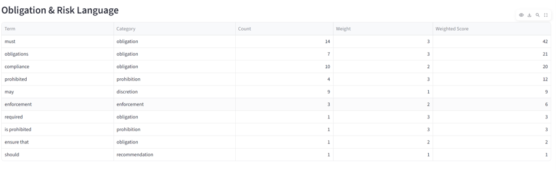
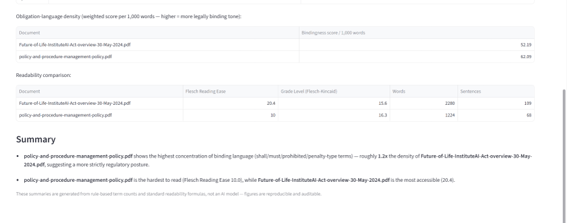

# AI Policy Visualizer

A Streamlit tool for analyzing and comparing regulatory/policy documents — built to answer three questions a policy analyst actually asks: *What is this document about? How binding is its language? How accessible is it to read?*

Rather than generic NLP keyword extraction, this tool applies rule-based, auditable methods specifically suited to policy and legal text analysis, and supports comparing multiple documents (e.g. across jurisdictions) side by side.

## Features

- **Keyword extraction** — word-frequency analysis (single document) and TF-IDF distinctiveness scoring (across multiple documents), visualized as bar charts and word clouds.
- **Obligation & Risk Language Scanner** — detects and weights ~35 legally significant terms (e.g. "shall," "must," "prohibited," "penalty," "may," "should") across four categories: obligation, prohibition, enforcement, and recommendation/discretion. Each term carries a "bindingness" weight (1–3), producing a weighted **obligation density score** per 1,000 words — a quantitative proxy for how binding vs. advisory a document's language is.
- **Readability metrics** — Flesch Reading Ease and Flesch-Kincaid Grade Level, benchmarked against typical legislative text (~40 on Flesch Reading Ease), to assess plain-language accessibility.
- **Cross-document comparison** — upload multiple documents to compare distinctive terminology (TF-IDF), obligation density, and readability side by side, with an auto-generated plain-English summary of the key differences.
- **Exportable Policy Brief (PDF)** — a one-page downloadable report per document summarizing keywords, obligation language, and readability.

All analysis is rule-based (regex term-matching, standard readability formulas, TF-IDF) — no black-box AI model is used for scoring, so every number is reproducible and explainable.

## Example use case

Upload the EU AI Act and the OECD AI Principles side by side. The Compare tab surfaces findings like:

> *"EU AI Act shows the highest concentration of binding language (shall/must/prohibited/penalty-type terms) — roughly 3.2x the density of OECD AI Principles — suggesting a more strictly regulatory posture, consistent with its status as binding law vs. a voluntary framework."*

## Screenshots


*Top keywords and word cloud for a single uploaded document.*


*Weighted obligation/prohibition/enforcement language detected in the document.*


*Side-by-side comparison of two documents with an auto-generated interpretive summary.*


## Live Demo:
https://aipolicyvisulizer-4vmaixdpm5hcnssgstwcuj.streamlit.app/

## Tech stack

- **Streamlit** — UI
- **PyMuPDF (fitz)** — PDF text extraction
- **scikit-learn** — TF-IDF vectorization
- **textstat** — readability scoring
- **WordCloud / Matplotlib** — visualizations
- **fpdf2** — PDF report generation

## Installation

```bash
pip install -r requirements.txt
```

## Usage

```bash
streamlit run app.py
```

Then open the local URL Streamlit prints (usually `http://localhost:8501`), and upload one or more `.pdf` or `.txt` policy documents.

## Project structure

```
app.py              # Main Streamlit application
requirements.txt     # Python dependencies
```

## Limitations

- PDF text extraction requires a text-based PDF (scanned/image-only PDFs are not supported without OCR).
- The obligation-term list is curated but not exhaustive — it can be extended in `OBLIGATION_TERMS` in `app.py`.
- Readability formulas are designed for English prose and may be less reliable on heavily structured legal text (numbered clauses, defined terms, etc.).

## Author

Avantika (Nish) Nepal — built as part of ongoing work in AI governance and policy analysis.